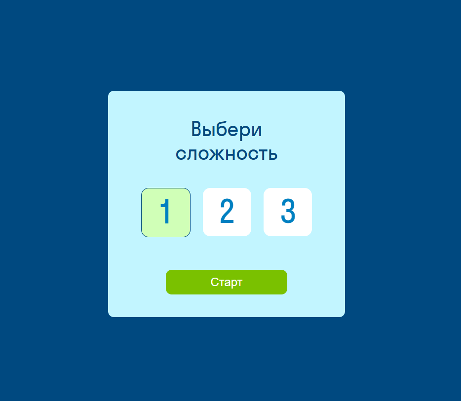
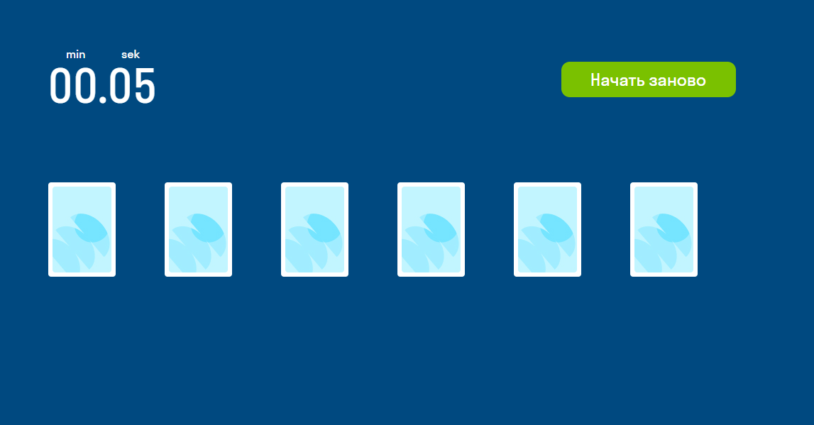
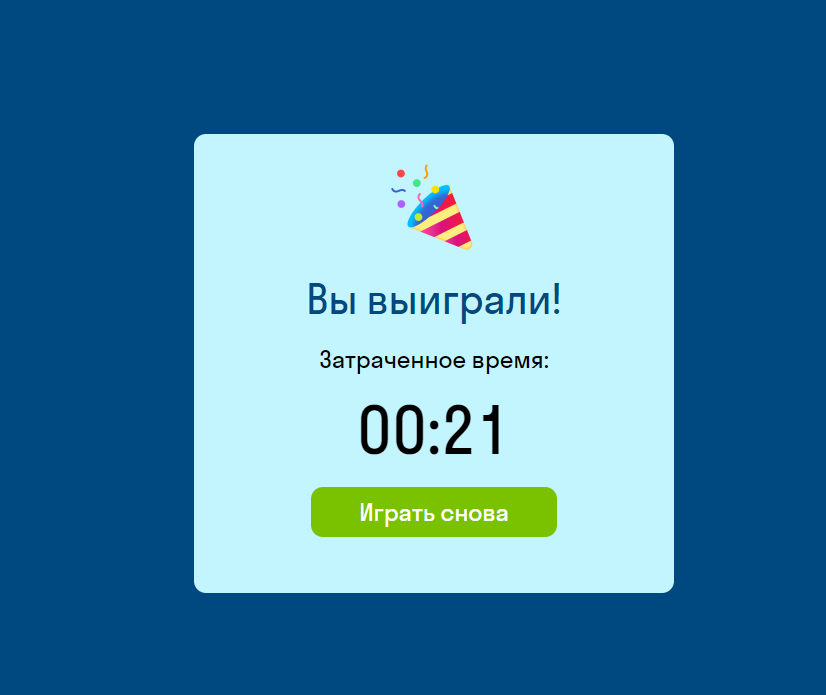
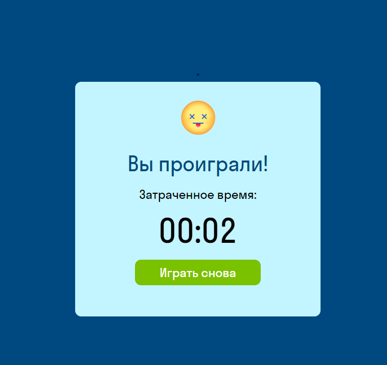

# Карточная игра "Memory Card Game"

## Описание проекта
Карточная игра "Memory Card Game"

Основная цель - найти одинаковые по рангу и масти пары карт.

Правила игры:

1. Игрок выбирает уровень сложности игры. От уровня зависит количество показываемых карточек. (1 уровень - 6 карт, 2 уровень - 12 карт, 3 уровень - 18 карт).

2. На экране показываются все карты на 5 секунд, игрок видит ранги и масти карт, затем они закрываются.

3. Игроку нужно найти все пары карт. Карты открываются при клике.

Если игрок не угадал пару - игра заканчивается проигрышем.
Если карточки совпали - игра продолжается.
Если игрок угадал все пары - игра заканчивается победой.

## Технический стек
-  React
-  TypeScript 
- 	Форматирование и подсветка ошибок с помощью prettier и eslint.
-	Автоматическая проверка типов перед коммитом с помощью husky.

## Установка и запуск проекта:

-   Необходимо клонировать репозиторий git clone git@github.com:tanya-bulaeva/Card-Memory.git
-   Установить зависимости: npm install;
-   Запустить приложение: npm run start;

## Визуал

